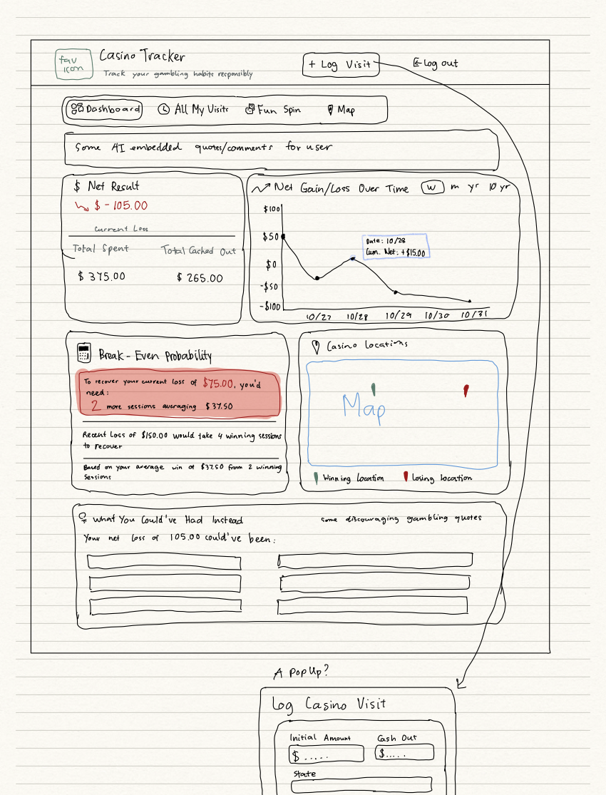

# Module 2 Group Assignment

CSCI 5117, Fall 2025, [assignment description](https://canvas.umn.edu/courses/518559/pages/project-2)

## App Info:

* Team Name: HIGH expectations
* App Name: Gamblr
* App Link: gamblr-16a50.web.app

### Students

* Vy Bui Nguyen, buing004@umn.edu
* Quenton Ni, ni000100@umn.edu
* Mary Duong, duong220@umn.edu
* Brenen Olson, ols00175@umn.edu
* Cheston Opsasnick, opsas002@umn.edu

## Key Features

**Describe the most challenging features you implemented
(one sentence per bullet, maximum 4 bullets):**

* Draggable widget system
* Speech to text
* Visits filtering
* Practice 3d environment

Which (if any) device integration(s) does your app support?

* Microphone

Which (if any) progressive web app feature(s) does your app support?

* N/A

## Mockup images

**[Add images/photos that show your mockup](https://stackoverflow.com/questions/10189356/how-to-add-screenshot-to-readmes-in-github-repository) along with a very brief caption:**

*Low-fidelity prototype of CasinoTracker highlighting the landing page, log in, listings interface, and various users' own visit details.*

* You can find the full prototype at prototype/Project2LowFidelityMockUp.pdf

## Testing Notes

**Is there anything special we need to know in order to effectively test your app? (optional):**

* N/A

## Screenshots of Site (complete)

**[Add a screenshot of each key page](https://stackoverflow.com/questions/10189356/how-to-add-screenshot-to-readmes-in-github-repository)
along with a very brief caption:**

Splash Page

Dashboard View

My Visits View

Practice View

## External Dependencies

**Document integrations with 3rd Party code or services here.
Please do not document required libraries (e.g., VUE, Firebase, vuefire).**

Three.js - 3d Scene

Slot Machine - licensed under CC Attribution
deepakyhr
[https://skfb.ly/poJNB]

Gameready Casino scene - Free Standard License
Katydid
[https://skfb.ly/pC86Y]

Heatmap - Used for heatmap widget

Chart.js - Used for a few widgets

Primevue - Used for components, charts, and icons

Google Cloud Speech to API - Speech to text for notes

**If there's anything else you would like to disclose about how your project
relied on external code, expertise, or anything else, please disclose that
here:**

...
